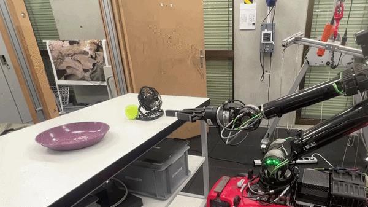
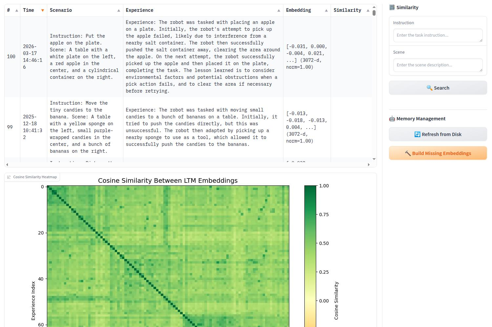

# PragmaBot

**A Pragmatist Robot: Learning to Plan Tasks by Experiencing the Real World**

[](https://ieeexplore.ieee.org/document/11419794)
[](https://arxiv.org/abs/2507.16713)
[](https://wiki.ros.org/noetic)
[](https://www.python.org/)
[](LICENSE)

<p align="center">
  
  <br/>
  <em>Robot completes a new task guided by a long-term memory of self-reflective experiences.</em>
</p>

PragmaBot enables robots to **learn to plan tasks by experiencing the real world** — without model fine-tuning or dense human supervision. A vision-language model (VLM) evaluates action outcomes and self-reflects on failures, storing reflections in a short-term memory (STM) for within-task adaptation. After each task, the robot distills these lessons into a long-term memory (LTM) and uses retrieval-augmented generation (RAG) to draw on past experiences when planning new tasks.

> **Key Results:** STM self-reflection raises task success from **35 % → 84 %**. LTM with RAG raises single-trial success from **22 % → 80 %**, generalizing to previously unseen scenarios.

**[Project Page](https://pragmabot.github.io)** | **[Paper (IEEE RAL 2026)](https://ieeexplore.ieee.org/document/11419794)** | **[arXiv](https://arxiv.org/abs/2507.16713)**

---

## PragmaBot Pipeline

Each task executes the following sequence:

1. `VLMSceneDescriber` produces a natural-language description of the initial scene, which is combined with the user instruction to form a scenario key.
2. `MemoryManager` retrieves the top-*k* most relevant experiences from the LTM via cosine similarity over text embeddings.
3. `VLMTaskPlanner` selects the next action based on the current observation, retrieved LTM entries, and the accumulated STM.
4. **Action execution** (user-provided) — see [Extending with Action Execution](#extending-with-action-execution).
5. `VLMSuccessDetector` compares before/after images, returning binary signals for action success and task completion, along with a natural-language scene-change description.
6. The (action, evaluation) pair is appended to the STM and fed back to `VLMTaskPlanner` for the next planning step (including self-reflection on failure); steps 3–6 repeat.
7. On **task completion**, `VLMExperienceSummarizer` distills the full STM episode into a compact experience and stores it in the LTM for future retrieval.

## Prerequisites

- **Ubuntu 20.04** with [ROS Noetic](https://wiki.ros.org/noetic/Installation/Ubuntu/)
- **Python 3.8+** (virtual environment recommended)
- **OpenAI API key** (for GPT-4o / text embeddings)

> **Not on Ubuntu 20.04?** Use [Distrobox](https://distrobox.it/) to spin up an Ubuntu 20.04 user-space on any modern Linux distribution so you can match the expected ROS/apt environment.

## Installation

> We recommend using a Python virtual environment for all pip installations.

### 1. Clone the Repository

```bash
git clone https://github.com/leggedrobotics/pragmabot.git
cd pragmabot
```

### 2. Install Python Dependencies

```bash
pip install -r requirements.txt
```

### 3. Build the ROS Package

```bash
cd <catkin_workspace>
catkin config -DCMAKE_BUILD_TYPE=RelWithDebInfo -DPYTHON_EXECUTABLE=$(which python3)
catkin build pragmabot
```

## Configuration

All parameters are in [`pragmabot/config/config.yaml`](pragmabot/config/config.yaml).

Set the API key for your chosen VLM provider before running (We recommend you put it in `~/.bashrc`):

```bash
# For GPT-4o models (default)
export OPENAI_API_KEY="your-openai-api-key"
```

## Usage

### PragmaBot

```bash
roslaunch pragmabot launch_pragmabot.launch
```

Open the **Gradio URL** printed in the terminal (e.g., `http://0.0.0.0:7861`) to issue task instructions and monitor execution. To access the GUI from another device, enable `gradio_share` in the config.

<p align="center">
  
  <br/>
  <em>Gradio interface for task planning.</em>
</p>

### Long-Term Memory Management

```bash
roslaunch pragmabot manage_memory.launch
```

Opens a separate Gradio interface for inspecting LTM entries, viewing the cosine-similarity heatmap, querying by scenario, and building missing embeddings.

<p align="center">
  
  <br/>
  <em>Gradio interface for LTM inspection and management.</em>
</p>


### Rosbag Replay

Replay a recorded rosbag to run the pipeline without a physical robot:

```bash
roslaunch pragmabot replay_rosbag.launch bag_path:=/path/to/your.bag
```

This launch file runs an image republisher that remaps your recorded image topics to the topics the planner and success detector subscribe to. An RQT window opens where clicking on an image triggers republishing, giving you control over what PragmaBot receives.

Set `rosbag_replay: true` in `pragmabot/config/config.yaml` so the pipeline skips action execution and calls the success detector directly after planning.

Other launch files:
- `record_rosbag.launch` — throttle and record camera topics to a bag file.
- `visualize_rosbag.launch` — play a bag and visualize in RViz.


## Extending with Action Execution

This release includes the full VLM planning, evaluation, and memory pipeline. Action execution (step 4) — object detection, grasp generation, motion planning, and robot control — is left as a `NotImplementedError` for users to integrate with their own robot stack. See `handle_planning_request` in [`pragmabot/nodes/pragmabot_node.py`](pragmabot/nodes/pragmabot_node.py) for the integration point.

Recommended tools: [Grounded SAM](https://github.com/IDEA-Research/Grounded-Segment-Anything) for detection/segmentation, [GraspGen](https://github.com/NVlabs/GraspGen) for grasp generation, and [Pinocchio](https://stack-of-tasks.github.io/pinocchio/) for inverse kinematics.

## Results

Evaluated on a legged manipulator with a 6-DoF arm across 12 real-world object-manipulation scenarios.

### Short-Term Memory: Self-Reflection

| Task | Baseline (CaP-V) | PragmaBot |
|------|:---:|:---:|
| Put apple on plate (container obstructs) | 43% | **86%** |
| Move tiny candy (sponge/towel nearby) | 22% | **67%** |
| Move egg (open view) | 40% | **100%** |
| Pick up bowl (apple inside) | 33% | **83%** |

### Long-Term Memory: Generalization to New Scenarios

| Task | Baseline (COME) | PragmaBot (RAG) |
|------|:---:|:---:|
| Put apple on plate (container obstructs) | 29% | **100%** |
| Move tiny candy (towel nearby) | 11% | **78%** |
| Move egg (open view) | 20% | **100%** |
| Pick up bowl (apple inside) | 17% | **83%** |
| Put tennis ball in box (mug obstructs) | 29% | **71%** |
| Put orange/ball on plate (fan blocks) | 10% | **80%** |
| Move crumpled paper (brush nearby) | 25% | **63%** |
| Move screw (towel nearby) | 0% | **86%** |
| Move sushi (open view) | 14% | **71%** |
| Move grape/cherry (open view) | 20% | **70%** |
| Pick up box (apple on top) | 43% | **86%** |
| Pick up towel (orange on top) | 50% | **75%** |

## Repository Structure

```
pragmabot/                          # Root
├── pragmabot/                      # ROS catkin package
│   ├── config/
│   │   └── config.yaml             # All runtime parameters (VLM model, memory settings, etc.)
│   ├── launch/
│   │   ├── launch_pragmabot.launch # Main node + TF + rqt
│   │   ├── manage_memory.launch    # LTM inspection UI
│   │   ├── replay_rosbag.launch    # Replay a bag with image republishing
│   │   ├── record_rosbag.launch    # Throttle and record camera topics
│   │   └── visualize_rosbag.launch # Play a bag and visualize in RViz
│   ├── nodes/
│   │   ├── pragmabot_node.py       # Main node with Gradio UI
│   │   ├── memory_manager_node.py  # LTM inspection UI (Gradio)
│   │   ├── image_decompressor_node.py
│   │   └── image_republisher_node.py
│   ├── src/pragmabot/              # Python library
│   │   ├── vlm_client.py           # OpenAI API wrapper (chat + embeddings)
│   │   ├── vlm_scene_describer.py  # Step 1: scene description
│   │   ├── vlm_task_planner.py     # Step 3: action planning with STM/LTM
│   │   ├── vlm_success_detector.py # Step 5: before/after success evaluation
│   │   ├── vlm_exp_summarizer.py   # Step 7: STM → LTM summarization
│   │   ├── memory_manager.py       # LTM storage, embedding retrieval
│   │   ├── conversation_builder.py # Sync VLM messages ↔ Gradio UI log
│   │   ├── scene_observer.py       # Synchronized ROS camera subscriber
│   │   ├── geometry.py             # RigidTransform, CameraIntrinsics
│   │   ├── simple_config.py        # OmegaConf YAML loader
│   │   └── utils.py                # Image encoding, path helpers
│   ├── data/
│   │   ├── logs/                   # Conversation logs (JSON)
│   │   └── ltm/                    # Long-term memory (CSV + embeddings)
│   ├── viz/                        # RViz and rqt perspective files
│   ├── package.xml
│   ├── CMakeLists.txt
│   └── setup.py
├── scripts/                        # Offline analysis and figure generation
├── docs/                           # Images for README
├── requirements.txt
├── CONTRIBUTING.md
├── CHANGELOG.md
├── LICENSE
└── README.md
```

## Citation

If you find this work useful, please cite:

```bibtex
@article{qu2026pragmatist,
  title={A Pragmatist Robot: Learning to Plan Tasks by Experiencing the Real World},
  author={Qu, Kaixian and Lan, Guowei and Zurbrügg, René and Chen, Changan and Mower, Christopher E and Bou-Ammar, Haitham and Hutter, Marco},
  journal={IEEE Robotics and Automation Letters},
  year={2026},
  publisher={IEEE}
}
```

## Contributing

We welcome contributions! Please see [CONTRIBUTING.md](CONTRIBUTING.md) for guidelines.

## Changelog

See [CHANGELOG.md](CHANGELOG.md) for release history.

## License

BSD 3-Clause License. See [LICENSE](LICENSE) for details.

## Acknowledgements

- [OpenAI API](https://platform.openai.com/) — VLM inference and text embeddings
- [Gradio](https://www.gradio.app/) — Web UI for interactive demos
